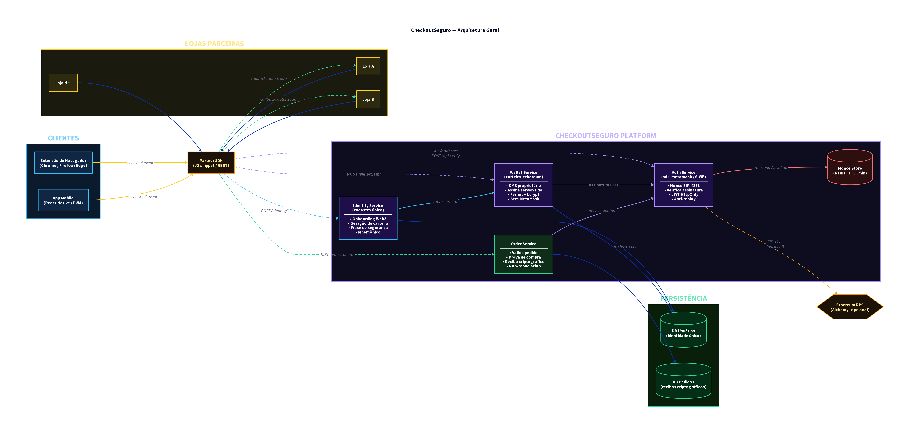

# CheckoutSeguro

> Plataforma de autenticação Web3 custodial para e-commerce: cadastro único, assinatura de compras via Ethereum, sem MetaMask.

O **CheckoutSeguro** é uma solução B2B2C que une a conveniência da Web2 com a segurança irrefutável da Web3. O sistema atua como um provedor de identidade (Identity Provider) e cofre criptográfico (KMS), permitindo que usuários façam compras online assinadas na blockchain Ethereum sem precisar instalar carteiras, gerenciar chaves ou pagar taxas de rede (gas fees).

## O Problema que Resolvemos

No e-commerce tradicional, o *chargeback* (quando o cliente alega "não fui eu que comprei") é um dos maiores ralos de dinheiro para os lojistas.
Na Web3, a assinatura criptográfica resolve o chargeback (não-repúdio), mas a fricção de uso (instalar MetaMask, guardar seed phrase) afasta 99% dos consumidores comuns.

## Nossa Solução

O **CheckoutSeguro** abstrai toda a complexidade da blockchain:
1. **Cadastro Único (SSO):** O usuário cria uma conta (e-mail, telefone e Frase de Segurança) uma única vez e pode usá-la em qualquer loja parceira.
2. **Carteira Custodial:** Nós geramos e protegemos a chave privada Ethereum do usuário em nosso backend.
3. **Assinatura Server-side:** No momento do checkout, o usuário digita sua Frase de Segurança na nossa extensão/app. O nosso servidor assina o pedido criptograficamente e entrega um "recibo" irrefutável para a loja.

## Arquitetura Geral

O ecossistema é composto por clientes (Extensão/Mobile), um SDK para lojas parceiras, e a plataforma central dividida em microsserviços.



Para um aprofundamento técnico, consulte a [Documentação de Arquitetura](./docs/ARQUITETURA.md).

## Cenários de Uso

A plataforma foi desenhada para ser fluida tanto para novos usuários quanto para os recorrentes:

- **[Cenário 1: Primeiro Acesso (Cadastro Único)](./docs/cenarios/CENARIO_1_NOVO_USUARIO.md)**
- **[Cenário 2: Usuário Existente (Login e Checkout)](./docs/cenarios/CENARIO_2_USUARIO_EXISTENTE.md)**

## Estrutura do Repositório

```text
.
├── auth-service/       # Serviço de autenticação SIWE (EIP-4361)
├── docs/               # Documentação técnica, cenários e diagramas
├── extension/          # Código-fonte da extensão de navegador (Chrome/Edge)
├── identity-service/   # Serviço de onboarding e gestão de usuários
├── infra/              # Configurações de infraestrutura (Docker, Terraform)
├── mobile/             # Aplicativo mobile (React Native / PWA)
├── order-service/      # Serviço de validação de pedidos e recibos
└── partner-sdk/        # SDK para integração nas lojas parceiras
```

## Próximos Passos (Roadmap)

Consulte o arquivo [ROADMAP.md](./docs/ROADMAP.md) para acompanhar as próximas fases de desenvolvimento, incluindo o lançamento da extensão, do app mobile e da integração on-chain (EIP-1271).
