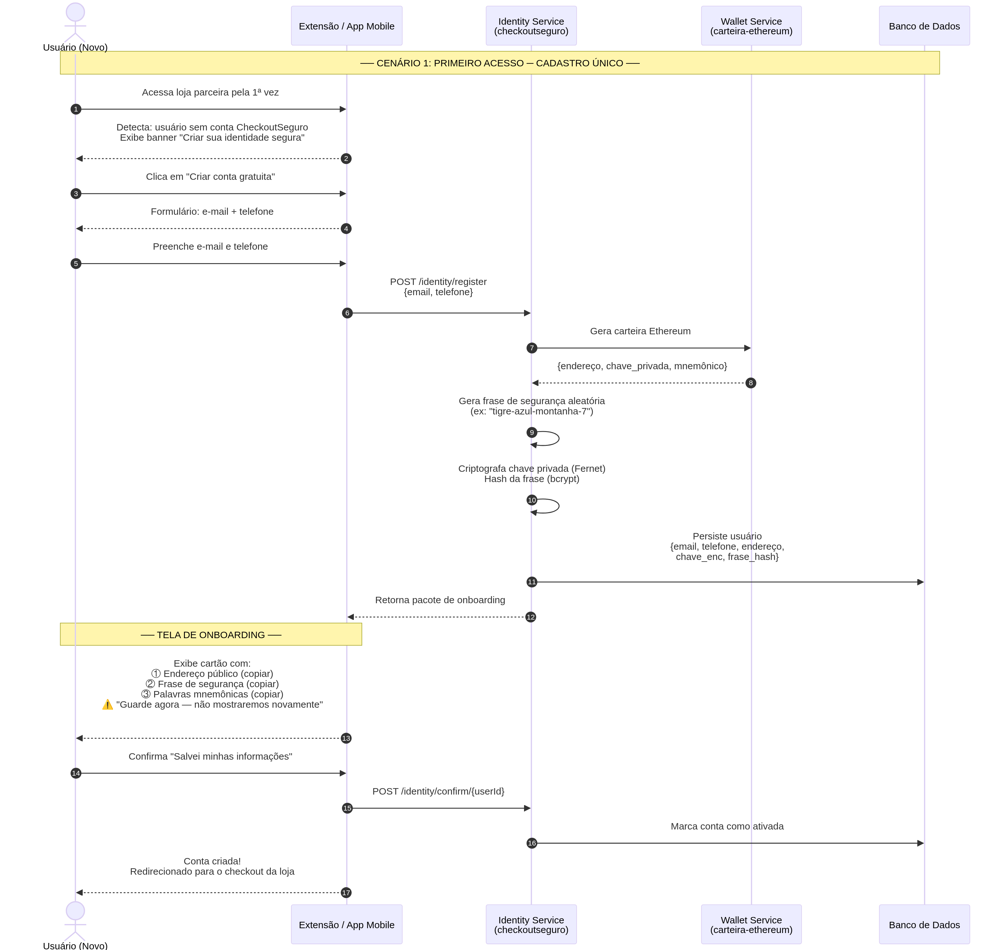

# Cenário 1: Primeiro Acesso (Novo Usuário)

Este cenário descreve o fluxo pelo qual um usuário que nunca utilizou o **CheckoutSeguro** passa ao tentar realizar uma compra em uma loja parceira pela primeira vez. O objetivo principal é garantir um *onboarding* (cadastro) com a menor fricção possível, mantendo os princípios de segurança da Web3.

## O Problema

O usuário comum não sabe o que é Ethereum, chave privada, mnemônico ou *gas fee*. Se ele for forçado a instalar uma extensão complexa como o MetaMask apenas para comprar uma camiseta, ele abandonará o carrinho.

## A Solução: Cadastro Único e Custodial

O CheckoutSeguro cria uma "identidade segura" em *background*. O usuário fornece apenas dados comuns (e-mail e telefone), e o sistema gera uma carteira criptográfica associada a ele. Essa identidade pode ser usada em **qualquer loja** que utilize o CheckoutSeguro no futuro.

### Fluxo do Usuário (Onboarding Invisível)

1. **Acesso à Loja Parceira:** O usuário navega na loja parceira e adiciona itens ao carrinho.
2. **Detecção:** Ao clicar em "Finalizar Compra", o Partner SDK (script instalado na loja) detecta que o usuário não possui uma sessão ativa do CheckoutSeguro.
3. **Chamada para Ação:** O SDK exibe um popup/banner amigável: *"Finalize sua compra com segurança total. Crie sua Identidade CheckoutSeguro"*.
4. **Preenchimento de Dados:** O usuário clica e é direcionado para um formulário simples (dentro da extensão de navegador ou app mobile) solicitando apenas:
   - E-mail
   - Telefone
5. **Geração da Identidade (Backend):** 
   - O `Identity Service` recebe os dados.
   - O `Wallet Service` gera um par de chaves Ethereum (endereço público e chave privada).
   - O `Identity Service` gera uma **Frase de Segurança** forte e memorizável (ex: `tigre-azul-montanha-7`).
   - A chave privada é criptografada com a chave mestra do servidor (Fernet) usando o hash (bcrypt) da Frase de Segurança.
   - Os dados são persistidos no banco de dados.
6. **Entrega das Credenciais:**
   - A extensão exibe um "Cartão de Identidade" contendo:
     1. O Endereço Público (seu identificador na rede).
     2. A Frase de Segurança (sua "senha" para aprovar compras).
     3. As 12 palavras mnemônicas (para recuperação futura, caso o usuário decida exportar a carteira).
   - O usuário é instruído a copiar e guardar essas informações de forma segura, com um aviso claro: *"Guarde agora — não mostraremos novamente"*.
7. **Confirmação e Redirecionamento:** Após o usuário confirmar que salvou as informações, a conta é ativada, e ele é redirecionado de volta ao checkout da loja parceira, já autenticado.

### Diagrama de Sequência

## Pontos Críticos de Segurança

- A chave privada **nunca** trafega pela rede ou fica armazenada em texto claro. Ela é criptografada imediatamente no momento da geração.
- O hash da Frase de Segurança é usado como entropia adicional para a criptografia (Fernet + bcrypt). Se o banco de dados vazar, as chaves privadas continuam inacessíveis sem as frases de segurança individuais de cada usuário.
- O "esquema de copia e cola" garante que o usuário assuma a responsabilidade por sua Frase de Segurança, educando-o sutilmente sobre a soberania de seus dados.
