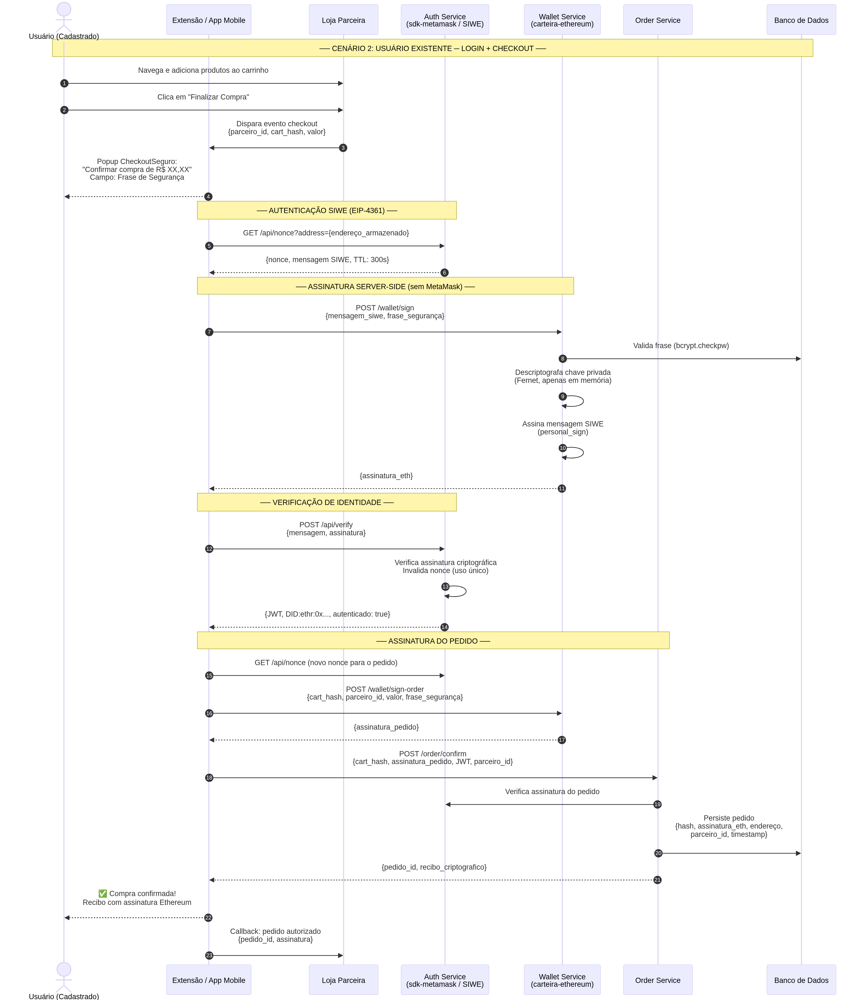

# Cenário 2: Usuário Existente (Login + Checkout)

Este cenário detalha a jornada de um consumidor que já possui sua "Identidade CheckoutSeguro" (criada conforme o [Cenário 1](./CENARIO_1_NOVO_USUARIO.md)) e retorna a uma loja parceira para realizar uma nova compra. O objetivo é fornecer uma experiência de *checkout* com 1 clique (ou 1 assinatura), substituindo senhas tradicionais por provas criptográficas irrefutáveis.

## O Problema

O e-commerce tradicional exige que o usuário crie e lembre dezenas de senhas, uma para cada loja diferente. Quando ele esquece a senha, o processo de redefinição causa abandono de carrinho. Além disso, compras baseadas apenas em login/senha são vulneráveis a fraudes e *chargebacks* (quando o usuário contesta a compra no cartão de crédito, alegando que "alguém invadiu sua conta").

## A Solução: Autenticação SIWE e Assinatura de Pedido

Com o CheckoutSeguro, o usuário possui uma única identidade (seu endereço Ethereum). Em vez de digitar uma senha, ele usa sua **Frase de Segurança** para que o servidor assine matematicamente (EIP-4361) seu login e seu pedido de compra. O lojista recebe uma prova criptográfica ("recibo") de que o dono legítimo daquela identidade autorizou a transação.

### Fluxo do Usuário (Login e Checkout em 1 Passo)

1. **Carrinho de Compras:** O usuário (já cadastrado) navega na loja parceira e clica em "Finalizar Compra".
2. **Disparo do Checkout:** O Partner SDK intercepta o clique e aciona a Extensão do CheckoutSeguro (ou o App Mobile via *deep link*).
3. **Popup de Confirmação:** A Extensão exibe um resumo limpo e seguro do pedido (ex: "Confirmar compra de R$ 250,00 na Loja X").
4. **Desafio de Autenticação (SIWE):** 
   - A Extensão solicita um *nonce* (desafio único) ao `Auth Service` do CheckoutSeguro.
   - O `Auth Service` retorna uma mensagem padrão EIP-4361 (Sign-In with Ethereum).
5. **Aprovação do Usuário:** 
   - O usuário visualiza a mensagem e o valor da compra.
   - Ele digita sua **Frase de Segurança** (ex: `tigre-azul-montanha-7`) e clica em "Assinar e Pagar".
6. **Assinatura Server-Side (A Mágica):**
   - A Extensão envia a Frase de Segurança e a mensagem SIWE para o `Wallet Service` (nosso cofre).
   - O `Wallet Service` valida o hash da frase (bcrypt) no banco de dados.
   - Se válido, ele descriptografa a chave privada do usuário **apenas em memória** (usando a chave mestra Fernet + a entropia da frase).
   - O `Wallet Service` assina a mensagem SIWE (`personal_sign`) e a devolve para a Extensão.
   - A chave privada é imediatamente apagada da memória.
7. **Validação da Sessão:**
   - A Extensão envia a assinatura para o `Auth Service`.
   - O `Auth Service` verifica a criptografia, invalida o *nonce* (prevenindo *replay attacks*) e emite um JWT de sessão (HttpOnly).
8. **Assinatura do Pedido (Recibo Irrefutável):**
   - Com a sessão ativa, a Extensão gera um *hash* do carrinho de compras e pede ao `Wallet Service` para assiná-lo (usando a mesma Frase de Segurança recém-digitada).
   - A assinatura do pedido é enviada ao `Order Service`.
   - O `Order Service` valida a assinatura e salva o pedido no banco de dados com a prova criptográfica (o endereço do comprador, o hash do pedido e a assinatura).
9. **Confirmação:** A Extensão exibe "Compra confirmada!" e redireciona o usuário para a página de sucesso da loja, passando o ID do pedido e o recibo criptográfico via callback.

### Diagrama de Sequência

## Vantagens de Segurança (Non-Repudiation)

- **Fim do Chargeback Fraudulento:** Se o usuário ligar para o banco dizendo "não fui eu que comprei", o lojista possui um recibo criptográfico. Esse recibo só pode ter sido gerado pela chave privada do usuário, que por sua vez só pôde ser acessada porque a Frase de Segurança exata foi fornecida no momento exato (protegida pelo *nonce* de 5 minutos).
- **Sem MetaMask:** Todo o peso da criptografia acontece no backend do CheckoutSeguro (`Wallet Service`). O usuário só precisa lembrar de sua Frase de Segurança.
- **SSO (Single Sign-On):** O usuário usa a mesma Frase de Segurança para comprar na Loja A, Loja B e Loja C. A identidade dele é universal e portável.
